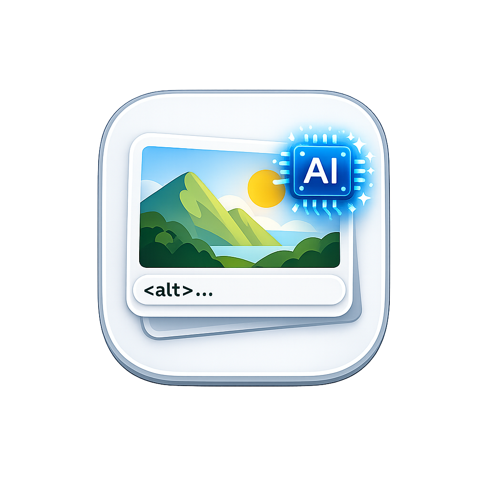

<div align="center">
  
  <h1>⚡ Alt-Tag Studio</h1>
</div>

**Alt-Tag Studio** is a powerful, privacy-first, AI-driven application designed to automate the tedious process of writing WCAG-compliant `alt` texts for HTML images. 

Rather than uploading your entire codebase to an online tool, Alt-Tag Studio is a native desktop application that works completely **locally on your machine**. It uses the modern File System Access API to parse your HTML, read your local image folders securely, and seamlessly inject AI-generated alt texts back into your original HTML files without requiring you to manually copy, paste, or download duplicated files.

## 🚀 Download for macOS, Windows, Linux

[](https://github.com/cyogesh56/Alt-Tag-Studio/releases/)

---


## ✨ Features

- **Available on macOS, Windows & Linux:** A truly cross-platform app to empower your workflow wherever you are.
- **Project-Wide IDE Layout:** Select your entire project folder and manage all HTML/HTM files dynamically from a sleek, Visual Studio-style 3-column static file explorer.
- **Multi-File Tabbed Editor:** Open multiple HTML files simultaneously and easily navigate between them via tabs.
- **Session Restoration:** Automatically jump back into your last opened project on app restart.
- **Auto-Save & In-Place Seamless Saves:** Background 5-minute auto-save keeps your progress safe. You can also save in-place, save a copy, or restore the original file from the sidebar.
- **Multi-AI Provider Support:** Connect your API keys to industry-leading vision models. Includes out-of-the-box support for:
  -  Google Gemini
  -  OpenAI ChatGPT
  -  Anthropic Claude
- **Smart Auto-Switching:** If your active model runs out of quota (429 rate limit), the app automatically switches to your next configured API key to prevent workflow interruption. (Requires 2+ keys saved).
- **Intelligent Alt-Text Memory:** The app seamlessly remembers your generated alt-texts and permanently associates them with the image's filename. If that same image is detected anywhere else, the app instantly pre-fills the input box, preventing redundant API calls and manual copying.
- **Privacy-First Local Processing:** Your project files are parsed entirely locally. Only the specific images being processed are securely sent to the AI vision models as base64 strings.
- **Live Code Preview:** See exactly where your images exist in your HTML with real-time, auto-scrolling syntax highlighting with automatic long-line text wrapping.
- **Accessibility & UX:** Fully accessible with custom hover tooltips, screen-reader polite announcements, WCAG AA compliant contrast ratios, and a beautiful Dark/Light mode UI.

---

## 🛠️ How It Works

1. **Configure Provider:** Enter the API Key for your preferred AI provider in the setup screen or Settings. The AI dropdowns will dynamically only show providers you have configured keys for.
2. **Open Project Folder:** Select your website's root folder. The IDE will automatically scan and build a file tree.
3. **Select HTML Files:** Click any `.html` file from the explorer to open it in a new tab.
4. **Generate & Update:** The app displays the image and surrounding code context. Click **Generate with AI** to let the AI analyze the image, or write it manually. Click **Update & Next** to seamlessly inject the `alt` attribute back into your local file.

## 📝 Changelog

### v1.1.3
- **Feature:** Added a new "Save All Files" button to the sidebar for quicker explicit saves.
- **UI Fix:** Enforced CSS word-wrapping in the Code Preview pane via `lineProps` to correctly wrap long, individual code lines without horizontal scrollbars.
- **Accessibility Fix:** Added proper ARIA roles and auto-focus logic to all custom modal dialogs.
- **Accessibility Fix:** Made system toast notifications use `aria-live` so they are gracefully announced to screen-readers.
- **Accessibility Fix:** Explicitly marked decorative landing page images as hidden from screen readers.
- **Accessibility Fix:** Added `tabIndex` to scrollable text containers so keyboard-only users can navigate and scroll code previews.

### v1.1.2
- **UX Fix:** Reopening the app now automatically bypasses the landing page and opens directly into the IDE, seamlessly restoring your previous session.
- **Fix:** Fixed a bug where saved API keys were not correctly restoring from memory upon app launch.
- **Fix:** The "Save Copy" function now explicitly forces the native OS "Save As" dialog to prompt the user for the destination path.

### v1.1.0
- **Feature:** Introduced **Intelligent Alt-Text Memory**. Generated descriptions are now automatically saved and mapped to image filenames. The app will autonomously pre-fill the alt-text box whenever it encounters the same image globally, notifying the user.
- **Enhancement:** Added a comprehensive memory management panel in Settings to clear saved alt-texts safely.

### v1.0.6
- **Architecture:** Transitioned from a simple linear flow to a comprehensive Project-Wide IDE layout.
- **Feature:** Added native multi-file support. You can now open an entire directory and manage multiple HTML files via a tabbed interface.
- **Feature:** Session Persistence. The app automatically remembers your active project folder on restart.
- **Feature:** Introduced Auto-Switch logic that automatically falls back to the next saved API key if the active one runs out of quota (`429` error). This feature dynamically disables if fewer than two API keys are configured.
- **Feature:** Added robust decoding support to gracefully handle complex file paths (e.g., spaces converted to `%20`).
- **Feature:** Extensive Editor actions (Save a Copy, Restore Original, Skip Image, Navigate Back).
- **Enhancement:** AI Provider dropdowns dynamically filter to only display configured providers and use beautiful official provider SVG icons.
- **UI & Accessibility:** Restored the clean, static 3-column flexbox layout (Explorer, Code, Preview). Fast-rendering custom hover tooltips added for all sidebar actions.
- **UX & Rendering:** System toast notifications now gracefully animate from the bottom-center. Deep text-wrapping added to the code preview to eliminate horizontal scrolling.
- **Fix:** Intercepted all external links (e.g., "Get Key") to open in the user's default system browser rather than inside an internal Electron window.
- **Cleanup:** Removed deprecated API providers (DeepSeek, Qwen) to focus on top-tier multimodal vision models.

### v1.0.0
- **Initial Release:** Privacy-first, local File System Access API parsing for automated WCAG-compliant Alt-Text generation using Google Gemini, OpenAI ChatGPT, and Anthropic Claude.

---

## 🚀 Getting Started (Development)

Want to run Alt-Tag Studio locally, contribute, or build your own desktop version? Follow these steps:

### Prerequisites
- Node.js (v18+ recommended)
- Git

### 1. Clone the Repository
```bash
git clone https://github.com/cyogesh56/Alt-Tag-Studio.git
cd Alt-Tag-Studio
```

### 2. Install Dependencies
This project is built using React, Vite, TypeScript, and Tailwind CSS.
```bash
npm install
```

### 3. Run the Development Server
```bash
npm run dev
```
Open the `localhost` URL provided in your terminal to view the app in your browser.

---

## 📦 Building for Production

To build the optimized static web assets:
```bash
npm run build
```
This will generate a `dist` folder containing the compiled app, ready to be hosted on Vercel, Netlify, or any static file server.

### Desktop App Conversion (Electron / Tauri)
Alt-Tag Studio is designed to be highly portable and operates perfectly within Chromium wrappers since it relies on modern browser APIs (like the File System Access API). 
If you want to package this into a standalone macOS/Windows app, you can easily wrap the Vite build in **Electron** or **Tauri**. 
*(Note: Be sure to handle API key persistence using electron-store or Tauri plugins if transitioning away from the browser's local state).*

---

## 🤝 Contributing
Contributions, issues, and feature requests are always welcome! Feel free to fork this repository, make your tweaks, and submit a Pull Request.

## 📄 License
This project is open-source. Feel free to use, modify, and distribute it as needed.
